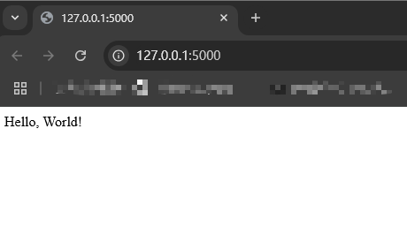

# Flask Overview

## Python Install

Please install the python on your computer based on [Python](https://www.python.org/).
If the system has some environmental path error when using the python order, please read [How to add to the PYTHONPATH in Windows](https://stackoverflow.com/questions/3701646/how-to-add-to-the-pythonpath-in-windows-so-it-finds-my-modules-packages).

### Virtual environments

Use a virtual environment to manage the dependencies for your project, both in development and in production.

What problem does a virtual environment solve? The more Python projects you have, the more likely it is that you need to work with different versions of Python libraries, or even Python itself. Newer versions of libraries for one project can break compatibility in another project.

Virtual environments are independent groups of Python libraries, one for each project. Packages installed for one project will not affect other projects or the operating system’s packages.

1. Create an environment.

```powershell
mkdir myproject
cd myproject
py -3 -m venv .venv
```

2. Active the environment.

```powershell
.venv\Scripts\activate
```

## Install Flask

```powershell
pip install Flask
```

## Quickstart

### A Minimal Application

```python
from flask import Flask

app = Flask(__name__)

@app.route("/")
def hello_world():
    return "<p>Hello, World!</p>"
```

To run the application, use the `flask` command or `python -m flask`. You need to tell the Flask where your application is with the `--app` option.

```powershell
flask --app hello run
```



> As a shortcut, if the file is named app.py or wsgi.py, you don’t have to use --app. See Command Line Interface for more details.

#### Debug Mode

To enable debug mode, use the `--debug` option.

```powershell
flask --app hello run --debug
```

#### HTML Escaping

When returning HTML (the default response type in Flask), any user-provided values rendered in the output must be escaped to protect from injection attacks. HTML templates rendered with Jinja, introduced later, will do this automatically.

**escape()**, shown here, can be used manually. It is omitted in most examples for brevity, but you should always be aware of how you’re using untrusted data.

```python
from flask import Flask
from markupsafe import escape

app = Flask(__name__)

@app.route("/")
def hello_world():
    return "<p>Hello, World!</p>"

@app.route("/<name>")
def hello(name):
    return f"Hello, {escape(name)}!";
```

#### Routing

Modern web applications use meaningful URLs to help users. Users are more likely to like a page and come back if the page uses a meaningful URL they can remember and use to directly visit a page.

Use the **route()** decorator to bind a function to a URL.

```python
@app.route('/')
def index():
    return 'Index Page'

@app.route('/hello')
def hello():
    return 'Hello, World'
```

#### Variable Rules

You can add variable sections to a URL by marking sections with `<variable_name>`. Your function then receives the `<variable_name>` as a keyword argument. Optionally, you can use a converter to specify the type of the argument like `<converter:variable_name>`.

```python
from markupsafe import escape

@app.route('/user/<username>')
def show_user_profile(username):
    # show the user profile for that user
    return f'User {escape(username)}'

@app.route('/post/<int:post_id>')
def show_post(post_id):
    # show the post with the given id, the id is an integer
    return f'Post {post_id}'

@app.route('/path/<path:subpath>')
def show_subpath(subpath):
    # show the subpath after /path/
    return f'Subpath {escape(subpath)}'
```

|type|description|
|-|-|
|string|(default) accepts any text without a slash|
|int|accepts positive integers|
|float|accepts positive floating point values|
|path|like string but also accepts slashes|
|uuid|accepts UUID strings|

#### Unique URLs / Redirection Behavior

The following two rules differ in their use of a trailing slash.

```python
@app.route('/projects/')
def projects():
    return 'The project page'

@app.route('/about')
def about():
    return 'The about page'
```

The canonical URL for the projects endpoint has a trailing slash. It’s similar to a folder in a file system. If you access the URL without a trailing slash (/projects), Flask redirects you to the canonical URL with the trailing slash (/projects/).

The canonical URL for the about endpoint does not have a trailing slash. It’s similar to the pathname of a file. Accessing the URL with a trailing slash (/about/) produces a 404 “Not Found” error. This helps keep URLs unique for these resources, which helps search engines avoid indexing the same page twice.

#### HTTP Methods

Web applications use different HTTP methods when accessing URLs. You should familiarize yourself with the HTTP methods as you work with Flask. By default, a route only answers to `GET` requests. You can use the `methods` argument of the **route()** decorator to handle different HTTP methods.

```python
from flask import request

@app.route('/login', methods=['GET', 'POST'])
def login():
    if request.method == 'POST':
        return do_the_login()
    else:
        return show_the_login_form()
```

The example above keeps all methods for the route within one function, which can be useful if each part uses some common data.

You can also separate views for different methods into different functions. Flask provides a shortcut for decorating such routes with **get(), post()**, etc. for each common HTTP method.

```python
@app.get('/login')
def login_get():
    return show_the_login_form()

@app.post('/login')
def login_post():
    return do_the_login()
```

If GET is present, Flask automatically adds support for the HEAD method and handles HEAD requests according to the HTTP RFC. Likewise, OPTIONS is automatically implemented for you.

#### Static Files

Dynamic web applications also need static files. That’s usually where the CSS and JavaScript files are coming from. Ideally your web server is configured to serve them for you, but during development Flask can do that as well. Just create a folder called static in your package or next to your module and it will be available at /static on the application.

To generate URLs for static files, use the special 'static' endpoint name:

```python
url_for('static', filename='style.css')
```

The file has to be stored on the filesystem as static/style.css.

#### Rendering Templates

Generating HTML from within Python is not fun, and actually pretty cumbersome because you have to do the HTML escaping on your own to keep the application secure. Because of that Flask configures the Jinja2 template engine for you automatically.

Templates can be used to generate any type of text file. For web applications, you’ll primarily be generating HTML pages, but you can also generate markdown, plain text for emails, and anything else.

For a reference to HTML, CSS, and other web APIs, use the MDN Web Docs.

To render a template you can use the render_template() method. All you have to do is provide the name of the template and the variables you want to pass to the template engine as keyword arguments. Here’s a simple example of how to render a template:

```python
from flask import render_template

@app.route('/hello/')
@app.route('/hello/<name>')
def hello(name=None):
    return render_template('hello.html', person=name)
Flask will look for templates in the templates folder. So if your application is a module, this folder is next to that module, if it’s a package it’s actually inside your package:
```

Case 1: a module:

```text
/application.py
/templates
    /hello.html
```

Case 2: a package:

```text
/application
    /__init__.py
    /templates
        /hello.html
```

For templates you can use the full power of Jinja2 templates. Head over to the official Jinja2 Template Documentation for more information.

Here is an example template:

```html
<!doctype html>
<title>Hello from Flask</title>

  <h1>Hello {{ person }}!</h1>

  <h1>Hello, World!</h1>

```

#### Accessing Request Data

For web applications it’s crucial to react to the data a client sends to the server. In Flask this information is provided by the global **request** object. If you have some experience with Python you might be wondering how that object can be global and how Flask manages to still be threadsafe. The answer is context locals:

So what does this mean to you? Basically you can completely ignore that this is the case unless you are doing something like unit testing. You will notice that code which depends on a request object will suddenly break because there is no request object. The solution is creating a request object yourself and binding it to the context. The easiest solution for unit testing is to use the **test_request_context()** context manager. In combination with the with statement it will bind a test request so that you can interact with it. Here is an example:

```python
from flask import request

with app.test_request_context('/hello', method='POST'):
    # now you can do something with the request until the
    # end of the with block, such as basic assertions:
    assert request.path == '/hello'
    assert request.method == 'POST'
```